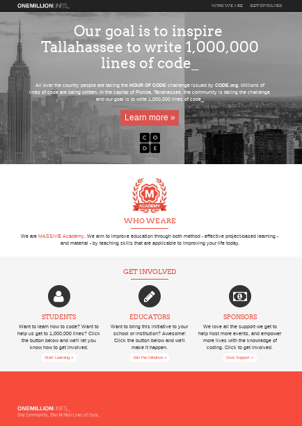

# One Million Lines #

Template **One Million Lines** built in Udemy course.

* Author: [Francis Rodrigues][1]
* Course: [Build Your First Website in 1 Week with HTML5 and CSS3][2]



## Get started ##

As developer, first you need to install all dependencies.

```bash
~$ npm install
```

After that, you can start the `http-server` as local server to test your application.

```bash
~$ npm run start
```

## References ##

* [Bootstrap 4.3][3]
* [Font-Awesome][4]
* [Markerbased OneMillionLines template][5]

Enjoy!

## License ##

MIT

  [1]: https://github.com/francisrod01
  [2]: https://www.udemy.com/build-your-first-website-in-1-week/
  [3]: https://getbootstrap.com/docs/4.3/
  [4]: https://fontawesome.com/start/
  [5]: http://www.makerbased.com/oml/
